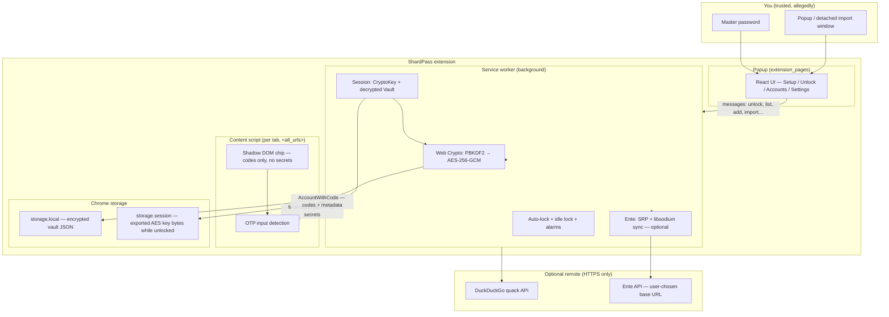

# ShardPass

<p align="center">
  <picture>
    
  </picture>
</p>

<p align="center">
  <strong>Your codes. Your machine. Your problem when you forget the master password.</strong>
</p>

ShardPass is a **local-first TOTP authenticator** for Chromium (MV3). Focus a 2FA field on any site and a floating chip shows up with the right code(s). Click. Paste. Feel briefly superior to people still thumb-typing six digits.

No cloud vault. No “trust us bro” server. Just you, a service worker with commitment issues, and secrets encrypted well enough that your past self would nod approvingly.

---

## Why exist?

Because authenticator apps shouldn’t require a pilgrimage to your phone, and browser extensions shouldn’t phone home with your TOTP seeds. ShardPass lives in the toolbar, matches accounts to the site you’re on, and fills the code when you ask — like a helpful gremlin that actually read the security docs.

---

## Features (the honest list)

| Thing | What it does |
|-------|----------------|
| 🔒 **Encrypted vault** | AES-256-GCM at rest; key from PBKDF2 (250k iter, SHA-256). Master password is **never** stored. |
| ⚡ **Inline autofill** | Content script spots OTP inputs; chip lists matching accounts with live codes + countdown. |
| 📥 **Import everything** | Manual secret, QR image, `otpauth://` dumps, encrypted JSON backup — or paste, because Chrome hates file pickers in popups. |
| 🪟 **Detached import window** | File picker opens a small centered window so Chromium doesn’t murder the popup mid-import. (Yes, this was a whole saga.) |
| 🪄 **Multi-account** | Five GitHub logins? The chip shows all five. Pick your poison. |
| 🦆 **DuckDuckGo aliases** | Optional `@duck.com` generation when adding accounts; token lives **inside** the encrypted vault. |
| 🔄 **Ente Auth sync** | Optional E2EE two-way sync with [Ente Auth](https://ente.io) — SRP login, libsodium crypto, your server or theirs. |
| 🌑 **Dark UI** | React + shadcn/ui. Minimal. No confetti. We have standards (they are low, but they exist). |

---

## Install (unpacked, like a civilized developer)

```bash
bun install
bun run build
```

1. Open `chrome://extensions` (or `brave://extensions`, `edge://extensions` — we don’t judge).
2. Enable **Developer mode**.
3. **Load unpacked** → select the **`dist/`** folder.
4. Reload after every build. Chrome extensions are a pet that only listens after you shake the food bag.

---

## First run

1. Click the toolbar icon → set a **master password** (≥ **12** characters; “password123” is not a personality).
2. Add accounts:
   - **Manual** — paste base32 secret, pretend you’re a hacker in a movie.
   - **QR image** — paste from clipboard (stays in popup) or choose file (opens detached window; see saga above).
   - **Import / Export** — `.json` encrypted backup or `.txt` of `otpauth://` URIs.
3. Visit a site’s 2FA page, focus the OTP field, click the chip. Done. Go touch grass.

---

## Inline autofill (how the gremlin finds you)

OTP inputs are detected via:

- `autocomplete="one-time-code"` (the spec actually helping for once)
- Heuristics on `name` / `id` / `placeholder` / `aria-label` / `data-testid` (`otp`, `2fa`, `totp`, `verification`, etc.)
- `inputmode="numeric"` with `maxlength` between 4 and 8

**Domain matching** tokenizes hostname + eTLD+1 and compares against each account’s `issuer`, `label`, and `tags`. `github.com` surfaces every account whose issuer smells like GitHub — including that alt account you swore you’d delete.

Multiple matches → list UI with issuer, label, live code, circular countdown. One match → still a list (we’re consistent, not clever).

---

## Import / export (and the popup that kept dying)

Chromium **closes the toolbar popup the moment it loses focus**. Opening the OS file picker counts as losing focus. So “choose `auth.txt` from Downloads” used to mean: popup gone, React tree dead, import never ran, user sad.

**Fix:** Import/Export and QR file-pick open a **detached `chrome.windows` popup** (centered, ~360px wide) that survives the file dialog. Paste and clipboard paths still work inside the main popup if you’re feeling efficient.

---

## DuckDuckGo Email Protection (optional)

Generate `@duck.com` aliases without leaving ShardPass.

1. [Sign up](https://duckduckgo.com/email/) → [autofill settings](https://duckduckgo.com/email/settings/autofill).
2. DevTools → **Network** → **Generate Private Duck Address** → copy `Authorization: Bearer …`.
3. **Settings → DuckDuckGo** → Connect.

Token is stored **inside the encrypted vault**, not in plain `chrome.storage.local`. Disconnect removes it. The popup never reads the token back after save — it only knows “configured: yes/no,” like a good vault should.

---

## Ente Auth sync (optional, for the sync enjoyers)

Two-way sync with Ente’s authenticator backend, end-to-end encrypted the way Ente intends:

- **Login:** SRP-6a (`fast-srp-hap`) + libsodium KEK derivation; 2FA supported; passkey-only accounts get a polite “not yet” message.
- **Sync:** Pull remote diffs, decrypt with your authenticator key, adopt local accounts by fingerprint; push local creates/updates/deletes via a deduped pending queue (survives SW restarts — we learned that the hard way).
- **Server:** Defaults to `https://api.ente.io`; self-hosted URL supported in advanced settings.

Ente credentials (`authToken`, `masterKey`, entity map, pending queue) live in the vault blob, encrypted with your ShardPass master password. Sync runs in the service worker; WASM CSP (`wasm-unsafe-eval`) is enabled for libsodium. Yes, the SW bundle is chunky. No, we can’t `import()` lazy-load in MV3 — the HTML spec said no and Chrome meant it.

---

## Security architecture

High-level: **one encrypted vault**, **one derived key in memory (and briefly in session storage)**, **three extension surfaces** that talk over `chrome.runtime` messages — never raw secrets in the DOM.



### Local vault (ShardPass-native)

| Layer | Mechanism |
|-------|-----------|
| **At rest** | Entire `Vault` JSON (accounts, Duck token, Ente integration state) encrypted as one AES-256-GCM blob in `chrome.storage.local`. |
| **Key derivation** | PBKDF2-HMAC-SHA256, **250,000** iterations, 16-byte random salt per vault. |
| **In memory** | `CryptoKey` + plaintext vault only in the service worker while unlocked. |
| **Session persistence** | Raw AES key bytes in `chrome.storage.session` so the SW can survive restarts without re-prompting until lock — cleared on lock, auto-lock, or screen lock. |
| **Master password** | Never written to disk. Wrong password → decrypt fails → unlock rejected. |
| **Export** | JSON backup contains ciphertext + salt + IV (re-import needs the **export** password). |

### Runtime surfaces & trust boundaries

| Surface | Sees secrets? | Notes |
|---------|---------------|--------|
| **Popup** | No (only after unlock via messages) | No `otpauth` secrets in DOM long-term; codes fetched on demand. |
| **Content script** | No | Receives `{ id, issuer, label, code, remainingSeconds }` — enough to fill, not enough to clone your life. |
| **Service worker** | Yes (when unlocked) | Sole place that decrypts vault, generates TOTP, talks to Ente/Duck APIs. |
| **Detached import window** | Same as popup | Same origin, `?view=io` / `?view=qr`; exists only to survive file-picker blur. |

### Auto-lock & idle behavior

- Configurable timer (`chrome.alarms`) — 0 = off.
- Optional **lock on OS screen lock** via `chrome.idle`.
- Lock wipes in-memory vault + session key; content script gets `locked: true` and stops showing codes.

### Permissions (why we ask)

| Permission | Why |
|------------|-----|
| `storage` | Encrypted vault + settings. |
| `activeTab` | Extension context on the current tab. |
| `alarms` | Auto-lock + Ente periodic sync. |
| `idle` | Lock when the OS locks. |
| `clipboardRead` / `clipboardWrite` | Paste imports / QR / copy codes & aliases. |
| `<all_urls>` | Content script must run on login pages for the chip — we don’t exfiltrate; we match hostname locally. |

### Ente integration (additional crypto)

When connected, the SW also holds Ente’s `authToken` and `masterKey` (for authenticator entity crypto) inside the **same encrypted vault blob**. Sync uses libsodium (Argon2id KEK, secretbox, secretstream, box seal) per Ente’s design. Network calls go to the configured API base only.

### What we don’t do (on purpose)

- No analytics phone-home.
- No plaintext secrets in `localStorage` / sync storage.
- No remote code execution — extension pages are `'self'` + WASM for libsodium only.
- No “recover your master password” — we’re an authenticator, not a therapist.

---

## Develop

```bash
bun run dev      # Vite watch → dist/
bun run build    # tsc --noEmit && vite build
bun run zip      # dist/ → shardpass.zip
```

[CRXJS](https://crxjs.dev/) powers the build. HMR in the popup works until you open a file picker and Chrome does its thing anyway.

### Layout

```
src/
├── background/     # MV3 SW — vault session, TOTP, Ente/Duck, auto-lock
├── content/        # OTP detection + Shadow DOM chip
├── lib/
│   ├── crypto.ts   # PBKDF2 + AES-GCM vault
│   ├── ente/       # Ente API, SRP, libsodium sync, queue
│   ├── totp.ts     # otpauth parsing + code generation
│   └── …
├── components/ui/  # shadcn primitives
└── popup/          # React app + detached import views
```

---

## Stack

- Chrome **MV3** (service worker + content script + popup)
- **React 18** + **TypeScript 5.7** + **Tailwind v4** + **shadcn/ui**
- **otpauth** · **jsqr** · **libsodium-wrappers-sumo** · **fast-srp-hap** (Ente)
- **Vite 6** · **Bun** · **CRXJS**

---

## Releases

| Tag | Notes |
|-----|--------|
| **v1** | Detached-window import fix (file picker vs. popup homicide). |
| **v2** | Ente Auth E2EE sync + settings UI. |

---

## License

[MIT](LICENSE) © Het Patel

If you fork this: keep the crypto boring, the UI quiet, and the jokes optional. The vault prefers stability over your clever refactor at 2 a.m.
